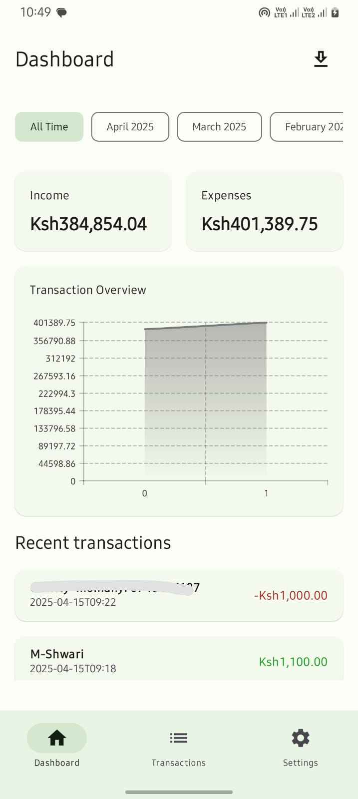
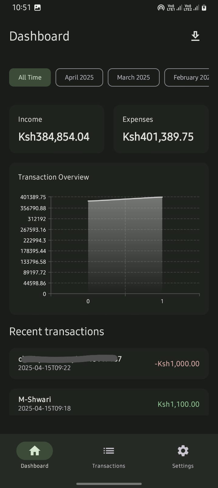
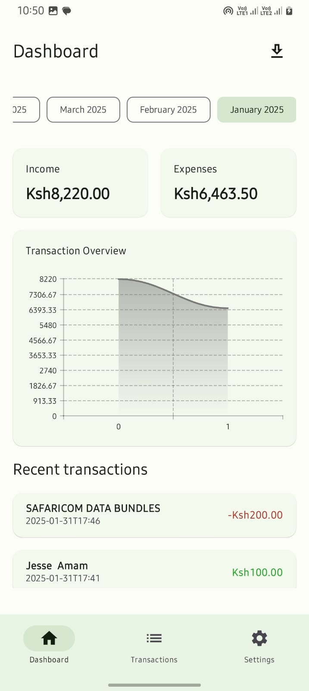

# 📊mTransaction – MPesa Transaction Analyzer

**mTransaction** is a mobile app built with **Kotlin** and **Jetpack Compose** that scans MPesa SMS messages and transforms them into structured financial insights. Designed to help users track, visualize, and export their mobile money transactions with ease.

---

# 🚀Features

- 🔍 **MPesa SMS Parsing**  
  Automatically scans and extracts MPesa transaction data from your SMS inbox.

- 📈 **Data Visualization**  
  View spending and income trends through graphs filtered by **month**, **year**, or custom ranges.

- 🗂️ **Structured History**  
  Browse transactions in an organized timeline, grouped by date and type.

- 💾 **Export Functionality**  
  Export your transaction data to local storage for backups, sharing, or personal analysis.

- ⚙️ **Optimized with Jetpack Compose**  
  Built using the modern Android UI toolkit with a clean MVVM architecture.

---

## 📷 Screenshots

  
  
  
  

---

## 🛠️ Tech Stack

- **Language:** Kotlin
- **UI:** Jetpack Compose
- **Architecture:** MVVM
- **SMS Parsing:** Android Telephony APIs
- **Data Layer:** Local storage (Room or file export)
- **Others:** Date filtering, dynamic charts

---

## 🎯 Use Case

`mTransaction` is perfect for anyone using MPesa who wants better visibility and control over their financial life — no spreadsheets or manual data entry needed.

---

## 📦 Future Improvements

- Cloud backup & sync (Firebase)
- Budgeting features
- Category tagging
- More granular filters (e.g. by merchant or transaction type)

---

## 👨‍💻 Author

**Jesse Jackson**  
Software Engineer | Mobile & Web Dev  
[GitHub](https://github.com/jesse-jacks0n) • [LinkedIn](https://www.linkedin.com/in/jesse-jackson-b774021a0)

---

## 📜 License

This project is open-source and available under the [MIT License](LICENSE).
